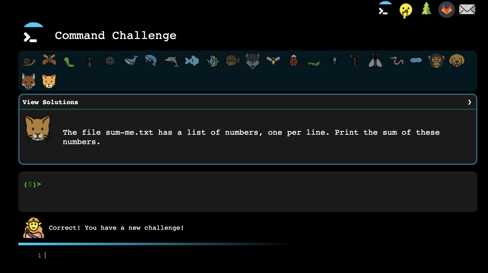

# 1904 Labs - Hours with Experts Application Challenge Problems
Data Engineering Hours With Experts Coding Challenge(s)!

## Challenges
Congrats on taking on the challenge of applying to Hours with Experts! We're looking forward to 
reviewing your challenge problems. Do not worry if you are unable to answer certain aspects of a question. 
We're looking for perseverance, problem solving, and breadth of knowledge across multiple different skillsets - Git, Command Line, SQL and a programming language such as Java, Scala, Python, C# or JavaScript. 

Your task is to work through and complete as much of each challenge problem as possible and submit your repository to our team for review. Good luck!

### Challenge #1 - Github
1. Navigate to the github directory in this repository in an editor of your choice or the command line
2. Follow the steps on the README in that directory to complete this challenge

### Challenge #2 - Command Line
Make it as far as you possibly can in the [Command Challenge](https://cmdchallenge.com/). If you get stumped, look on various resources online but don't click the view solutions button on the command challenge. We don't expect you to make it through completely, we just want to see
how far you can make it. Have fun with it and learn a lot! 

#### To submit your work: 
Take a screenshot of the farthest you got without clicking the "view solutions" button on the site. Submit your image in the Google Form sent to you when you were given your application. 



### Challenge #3 - Secret Recipe Code Challenge

Many years ago, the perfect cookie recipe was created and then lost... until now. An encrypted version was discovered
and it is up to you to recover the recipe so that the perfect cookie can be created once again.

The recipe is encrypted using a simple substitution cipher. For example, the encoded string `hgiikf` can be decoded to `butter`:

```
encoded -> decoded
      h -> b
      g -> u
      i -> t
      i -> t
      k -> e
      f -> r
```

The cipher is provided for you in a variable named `ENCODING` (see starter projects below). 

 - Challenge #1: Decode a string - Implement a function that takes an encoded string and returns the decoded value (`hgiikf` is decoded to `butter`).
 - Challenge #2: Decode an Ingredient - Implement a function that takes a line from the recipe and returns a new Ingredient (a class already defined for you). The `#` sign delimits the encoded amount and the description of an ingredient. For example, the line `8 vgl#hgiikf` would return an Ingredient with an amount of `1 cup` and a description of `butter`. 
 - Challenge #3: Decode the entire recipe - Read all of the ingredients out of `secret_recipe.txt`, decode each ingredient (hopefully using the functions you implemented above), and save the output into a new file named `decoded_recipe.txt`.

We have created starter projects in Java, Scala, and Python that you can use to get started:

- [Java Project](java/README.md)
- [Scala Project](scala/README.md)
- [Python Project](python/README.md)

Note: We will be coding in Python for the Hours with Experts course and strongly recommend you submit your code in python, but you are welcome to choose any language you would like and we'll take that into account. 

#### Important
When you are ready to start working on your solution, create a new branch called - yournameChallengeThree - ex) nickraffertyChallengeThree

#### To submit your work: 
Open a PR (pull request) against the `solution` branch. Link that PR in the Google Form that was sent to you when you received your application. 

## Things not to worry about
 * Validating command line arguments - you can just assume each program takes 1 argument which is always a valid number


